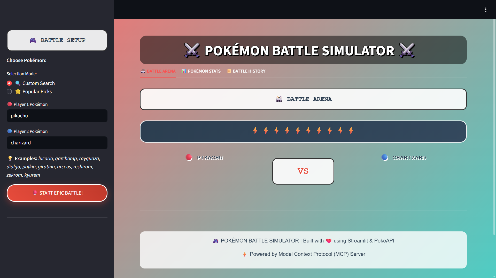
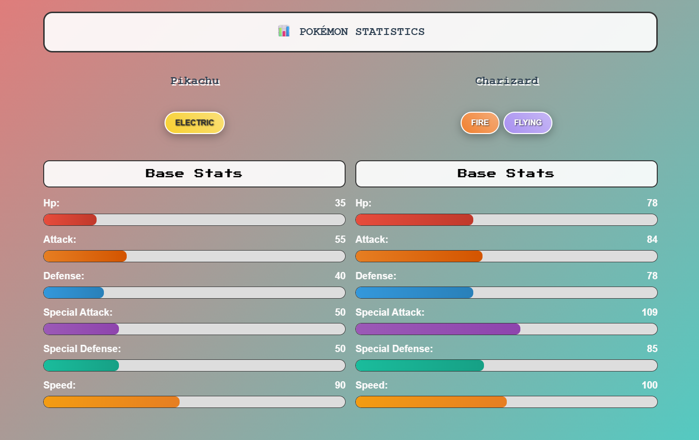
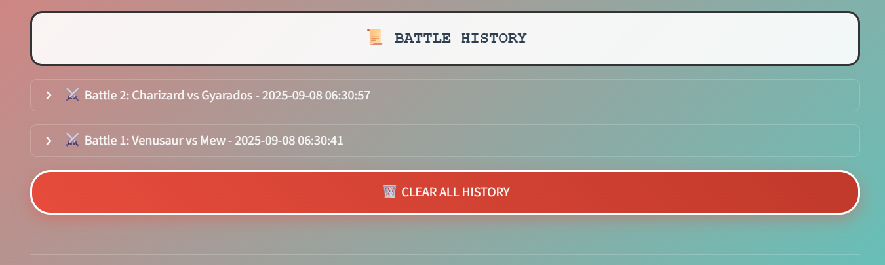

# 🎮 Pokémon Battle Simulator

## 🌐 Live Demo
**Try it now:** [https://pokemon-battle-sim-65mc.onrender.com](https://pokemon-battle-sim-65mc.onrender.com)

*Note: The app might take a minute to load as it's hosted on Render's free tier.*

---

An interactive Pokémon battle simulation application with both a beautiful Streamlit web interface and a Model Context Protocol (MCP) server backend. Battle any Pokémon with realistic game mechanics!



## ✨ Features

### 🎨 **Beautiful Streamlit Web Interface**
- **Pokemon-themed UI** with retro fonts and animations
- **Dual selection modes**: Custom search or popular picks dropdown
- **Real-time battle simulation** with formatted logs
- **Type badges** with authentic Pokemon colors
- **Animated stat bars** for each Pokemon attribute
- **Battle history** tracking and management



### ⚔️ **Advanced Battle System**
- **Realistic damage formula** based on official Pokemon games
- **Complete type effectiveness** system (18 types)
- **Status effects**: Paralysis, Burn, Poison
- **Critical hits** and STAB (Same Type Attack Bonus)
- **Turn-based combat** with speed-based turn order

### 🔧 **Technical Features**
- **MCP-compliant server** with FastAPI backend
- **Pokemon data** from PokéAPI integration
- **Caching system** for improved performance
- **Production-ready** error handling

## 🚀 Quick Start

### Option 1: Streamlit Web Interface (Recommended)
```bash
# Clone the repository
git clone https://github.com/Nachiketa-Singamsetty/pokemon-battle-sim.git
cd pokemon-battle-sim

# Install dependencies
pip install -r requirements.txt

# Run the web interface
streamlit run streamlit_app.py
```

### Option 2: MCP Server API
```bash
# Start the MCP server
uvicorn server:app --reload --port 8000
```

## 📁 Project Structure

```
pokemon-battle-sim/
├── streamlit_app.py          # Main Streamlit web interface
├── server.py                 # FastAPI MCP server
├── requirements.txt          # Python dependencies
├── README.md                # Documentation
├── resources/               # Pokemon data fetching
│   ├── __init__.py
│   └── pokemon_resource.py  # PokéAPI integration
└── tools/                   # Battle system
    ├── __init__.py
    ├── pokemon_battle.py    # Core battle mechanics
    └── battle_tool.py       # MCP battle tool
```

## Installation & Setup

### Prerequisites
- Python 3.10 or higher
- Internet connection (for PokéAPI access)
- PowerShell (for testing commands)

### Step 1: Create Virtual Environment

```powershell
# Create virtual environment
python -m venv venv

# Activate virtual environment (Windows PowerShell)
venv\Scripts\activate
```

### Step 2: Install Dependencies

```powershell
pip install -r requirements.txt
```

### Step 3: Start the Server

```powershell
# Start the MCP server with auto-reload
uvicorn server:app --reload --port 8000
```

**Important**: Keep the server running in one PowerShell window. Open a second PowerShell window to run the test commands below.

The server will be available at `http://localhost:8000`

## API Endpoints

### MCP Protocol Endpoints

| Endpoint | Method | Description |
|----------|--------|-------------|
| `/` | GET | Server information and available endpoints |
| `/resources` | GET | List available MCP resources |
| `/resources/read` | POST | Read a specific resource |
| `/tools` | GET | List available MCP tools |
| `/tools/call` | POST | Execute a tool |

### Available Resources

#### 1. Pokémon Stats Resource
- **URI**: `pokemon://stats/{pokemon_name}`
- **Description**: Get comprehensive Pokémon data including base stats, types, abilities, and moves
- **Example**: `pokemon://stats/pikachu`

#### 2. Evolution Chain Resource
- **URI**: `pokemon://evolution/{pokemon_name}`
- **Description**: Get evolution chain information for a Pokémon
- **Example**: `pokemon://evolution/charmander`

### Available Tools

#### Pokémon Battle Tool
- **Name**: `pokemon_battle`
- **Description**: Simulate a battle between two Pokémon
- **Parameters**:
  - `pokemon1` (required): Name of the first Pokémon
  - `pokemon2` (required): Name of the second Pokémon
  - `moves1` (optional): Array of up to 4 moves for first Pokémon
  - `moves2` (optional): Array of up to 4 moves for second Pokémon

## Usage Examples

**Note**: Make sure the server is running in one PowerShell window before executing these commands in a second PowerShell window.

### 1. Get Pokémon Stats

```powershell
Invoke-RestMethod -Uri "http://localhost:8000/resources/read" `
  -Method POST `
  -ContentType "application/json" `
  -Body '{"uri": "pokemon://stats/pikachu"}'
```

### 2. Get Evolution Chain

```powershell
Invoke-RestMethod -Uri "http://localhost:8000/resources/read" `
  -Method POST `
  -ContentType "application/json" `
  -Body '{"uri": "pokemon://evolution/charmander"}'
```

### 3. Simulate a Battle

```powershell
Invoke-RestMethod -Uri "http://localhost:8000/tools/call" `
  -Method POST `
  -ContentType "application/json" `
  -Body '{
    "name": "pokemon_battle",
    "arguments": {
      "pokemon1": "pikachu",
      "pokemon2": "charizard"
    }
  }'
```

### 4. Battle with Custom Moves

```powershell
Invoke-RestMethod -Uri "http://localhost:8000/tools/call" `
  -Method POST `
  -ContentType "application/json" `
  -Body '{
    "name": "pokemon_battle",
    "arguments": {
      "pokemon1": "pikachu",
      "pokemon2": "blastoise",
      "moves1": ["thunderbolt", "quick-attack", "thunder-wave", "agility"],
      "moves2": ["surf", "ice-beam", "earthquake", "focus-blast"]
    }
  }'
```

### 5. View Battle Results Clearly

To see the full battle log in a readable format:

```powershell
$response = Invoke-RestMethod -Uri "http://localhost:8000/tools/call" `
  -Method POST `
  -ContentType "application/json" `
  -Body '{
    "name": "pokemon_battle",
    "arguments": {
      "pokemon1": "mewtwo",
      "pokemon2": "gengar"
    }
  }'

$response.content.text
```

**Example Battle Output:**
```
=== POKÉMON BATTLE SIMULATION ===
Mewtwo vs Gengar

Initial Stats:
Mewtwo: HP 181/181, ATK 130, DEF 110, SP.ATK 174, SP.DEF 110, SPD 150
Gengar: HP 135/135, ATK 85, DEF 80, SP.ATK 150, SP.DEF 95, SPD 130

--- Turn 1 ---
Mewtwo used Fire-Punch!
Gengar took 52 damage! (83/135 HP remaining)
Gengar used Mega-Punch!
Mewtwo took 28 damage! (153/181 HP remaining)

--- Turn 2 ---
Mewtwo used Pay-Day! Critical hit!
It has no effect!
Gengar took 1 damage! (82/135 HP remaining)
Gengar used Ice-Punch!
Mewtwo took 25 damage! (128/181 HP remaining)

--- Turn 3 ---
Mewtwo used Fire-Punch!
Gengar took 51 damage! (31/135 HP remaining)
Gengar used Thunder-Punch!
Mewtwo took 25 damage! (103/181 HP remaining)

--- Turn 4 ---
Mewtwo used Ice-Punch!
Gengar took 31 damage! (0/135 HP remaining)
Gengar fainted!

=== BATTLE RESULT ===
Mewtwo wins!

Final HP:
Mewtwo: 103/181
Gengar: 0/135
```

## Battle Mechanics

### Damage Formula
The battle system uses the official Pokémon damage formula:
```
damage = (((2 * level / 5 + 2) * power * (Attack/Defense)) / 50) + 2) * modifiers
```

### Modifiers Include:
- **Critical Hit**: 1.5x damage (6.25% chance)
- **STAB (Same Type Attack Bonus)**: 1.5x damage when move type matches Pokémon type
- **Type Effectiveness**: 0x, 0.5x, 1x, 2x, or 4x based on type matchups
- **Status Effects**: Burn halves physical attack damage
- **Random Factor**: 85-100% for damage variation

### Status Effects

#### Paralysis
- 25% chance to be unable to move each turn
- Lasts 3 turns

#### Burn
- Deals 1/16 of max HP damage each turn
- Halves physical attack damage
- Lasts 3 turns

#### Poison
- Deals 1/8 of max HP damage each turn
- Lasts 3 turns

### Type Effectiveness Chart
The system implements the complete 18-type effectiveness chart from modern Pokémon games, including:
- Normal, Fire, Water, Electric, Grass, Ice
- Fighting, Poison, Ground, Flying, Psychic, Bug
- Rock, Ghost, Dragon, Dark, Steel, Fairy

## Testing

Run the comprehensive test suite:

```powershell
# Run all tests
pytest

# Run with coverage
pytest --cov=. --cov-report=html

# Run specific test file
pytest tests/test_battle_system.py -v
```

### Test Coverage
- **Pokémon Resource**: API integration, caching, error handling
- **Battle System**: Damage calculations, type effectiveness, status effects
- **Battle Tool**: MCP tool integration, battle simulation
- **Server**: FastAPI endpoints, MCP protocol compliance

## Architecture & Design

### Core Components

1. **MCP Server (`server.py`)**
   - FastAPI-based HTTP server
   - MCP protocol implementation
   - Resource and tool endpoint handlers

2. **Pokémon Resource (`resources/pokemon_resource.py`)**
   - PokéAPI integration
   - Data fetching and caching
   - Pokémon stats, moves, and evolution data

3. **Battle System (`tools/pokemon_battle.py`)**
   - Core Pokémon and Move classes
   - Battle mechanics and calculations
   - Type effectiveness system

4. **Battle Tool (`tools/battle_tool.py`)**
   - MCP tool wrapper for battle system
   - Battle simulation orchestration
   - Detailed battle logging

### Design Principles
- **Modular Architecture**: Clear separation of concerns
- **Error Handling**: Comprehensive exception handling and user feedback
- **Performance**: Caching system for API calls
- **Testability**: Dependency injection and mocking support
- **Extensibility**: Easy to add new features and Pokémon mechanics

## Performance Considerations

- **Caching**: API responses are cached to reduce PokéAPI calls
- **Rate Limiting**: Respectful API usage with session management
- **Memory Management**: Efficient data structures and cleanup
- **Async Support**: Async/await pattern for non-blocking operations

## Limitations & Assumptions

1. **Level**: All Pokémon battle at level 50 for consistency
2. **IVs/EVs**: Simplified stat calculation (no Individual Values or Effort Values)
3. **Move Pool**: Limited to first 20 moves from PokéAPI for performance
4. **AI**: Random move selection (no strategic AI)
5. **Battle Length**: Maximum 50 turns to prevent infinite battles

## Contributing

1. Fork the repository
2. Create a feature branch
3. Add tests for new functionality
4. Ensure all tests pass
5. Submit a pull request

## License

This project is open source and available under the MIT License.

## Acknowledgments

- **PokéAPI**: Free Pokémon data API (https://pokeapi.co/)
- **Model Context Protocol**: MCP specification and guidelines
- **FastAPI**: Modern Python web framework
- **Pokémon**: Game mechanics and formulas from the official games

## Troubleshooting

### Common Issues

1. **Import Errors**: Ensure virtual environment is activated and dependencies are installed
2. **API Timeouts**: Check internet connection and PokéAPI status
3. **Port Conflicts**: Change port in uvicorn command if 8000 is in use
4. **Memory Issues**: Restart server if caching uses too much memory

### Debug Mode

Start server with debug logging:
```powershell
uvicorn server:app --reload --log-level debug
```

### Health Check

Verify server is running:
```powershell
Invoke-RestMethod -Uri "http://localhost:8000/"
```

## Streamlit Web UI

### Running the Web Interface

In addition to the MCP server API, you can use the interactive Streamlit web interface for a user-friendly battle experience:

```powershell
# Make sure dependencies are installed (including streamlit)
pip install -r requirements.txt

# Start the Streamlit web app
streamlit run streamlit_app.py
```

The web interface will be available at `http://localhost:8501` and includes:

- **Interactive Battle Arena**: Easy-to-use interface for setting up battles
- **Real-time Pokémon Stats**: Visual display of Pokémon statistics with progress bars
- **Battle History**: Track and review previous battles
- **Custom Move Selection**: Choose specific moves for each Pokémon
- **Quick Battle Presets**: Pre-configured popular matchups
- **Downloadable Battle Logs**: Save battle results as text files

### Web UI Features

- **Beautiful Modern Design**: Clean, responsive interface with Pokémon-themed styling
- **Real-time Battle Simulation**: Watch battles unfold with detailed logs
- **Pokémon Data Visualization**: Stats displayed with interactive charts and progress bars
- **Battle Management**: History tracking and result downloading
- **Mobile Friendly**: Responsive design works on all devices



### Usage

1. Start the Streamlit app: `streamlit run streamlit_app.py`
2. Enter Pokémon names in the sidebar
3. Optionally customize moves for each Pokémon
4. Click "Start Battle!" to simulate the fight
5. View results in the Battle Arena tab
6. Check Pokémon stats in the Statistics tab
7. Review past battles in the History tab

## Future Enhancements

- [ ] Advanced AI for strategic move selection
- [ ] Support for abilities and held items
- [ ] Multi-battle tournaments
- [ ] Battle replay system
- [ ] WebSocket support for real-time battles
- [ ] Pokémon team builder tool
- [ ] Battle statistics and analytics
- [ ] Enhanced Streamlit UI with animations
- [ ] Multiplayer battle support
